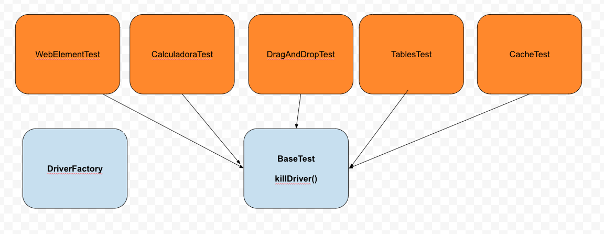
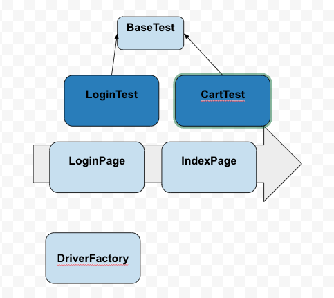

# Projeto do curso Automação com WebDriver #

## Projeto que está sendo desenvolvido no curso de Automação com WebDriver - Turma 10/24 ##

### Dependências utilizadas: ###
* Selenium WebDriver
* JUnit
* Apache POI

### Pré-requisitos: ###
* JDK >= 11 ou superior
* Google Chrome

## Estruturas das classes

## Estrutura de utilização do Page Objects
